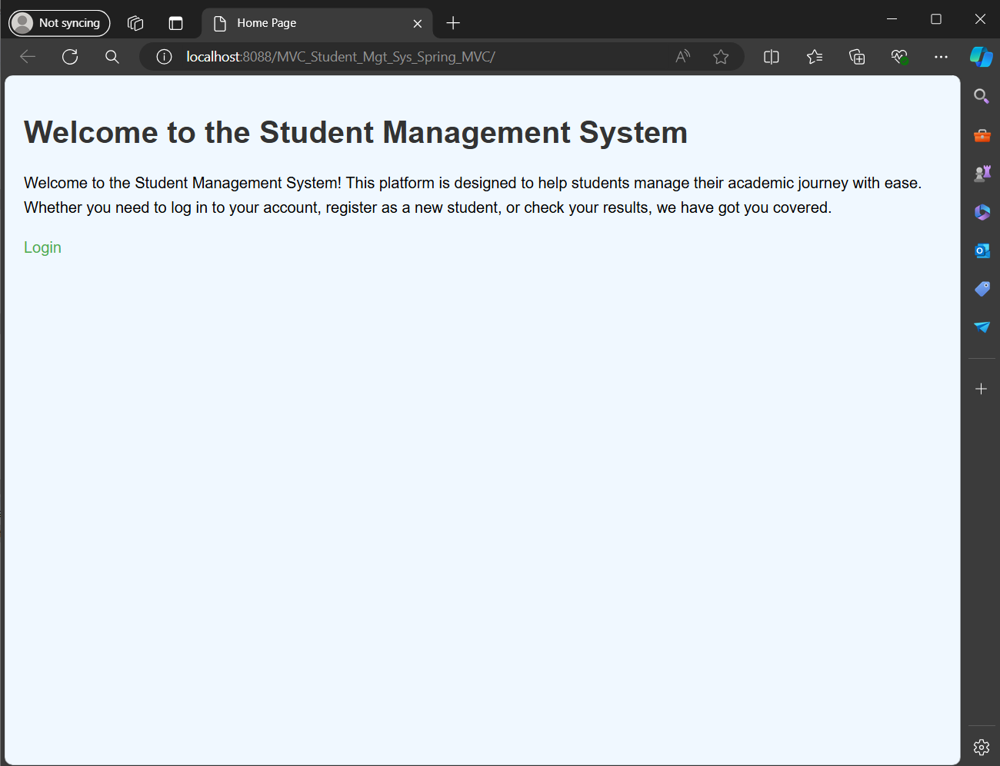

# Spring-MVC-Student-Mgt-Sys
This project is a Student Management System implemented using Spring MVC and Hibernate. It offering user authentication, CRUD operations for student records, and administrative capabilities. The system is built using Java, Spring MVC framework for web development, Hibernate for ORM , and JSP pages for the user interface.
A web-based Student Management System using Spring MVC and Hibernate.

## Table of Contents
- [Project Structure](#Project-Structure)
- [Technologies Used](#technologies-used)
- [Spring MVC Components](#Spring-MVC-Components)
- [View Layer (JSP Pages)](#View-Layer-(JSP-Pages))
- [Hibernate Configuration](#Hibernate-Configuration)
- [Features](#features)
- [ScreenShotes](#ScreenShotes)
- [Contact](#contact)

Here's the complete project structure for a simple student management system in Java using Spring Framework, Hibernate, and JSP for the views. This structure includes the model, controller, service, and DAO layers.
## Project Structure
1.	Model Layer:
            o	Student.java
2.	Controller Layer:
            o	HomeController.java
3.	Service Layer:
            o	StuServiceInterface.java
            o	StuServiceIMPL.java
4.	DAO Layer:
            o	StuDaoInterface.java
            o	StuDaoIMPL.java
5.	Views (JSP):
            o	Home.jsp
            o	Login.jsp
            o	Register.jsp
            o	Setpassword.jsp
            o	Update.jsp
            o	AdminDashboard.jsp
            o	StudentDetails.jsp

## Technologies Used

- Java
- Spring MVC
- Hibernate
- JSP/CSS/JavaScript

## Spring MVC Components
# DispatcherServlet Configuration: 
o	Configured in web.xml to handle all requests (/).
# Controller (HomeController):
o	Handles registration (/register) using @ModelAttribute to bind form data to Student object.
o	Handles login (/log) using @RequestParam to validate credentials against stored student data.
o	Supports CRUD operations (/del, /edit, /update) for students.
# Service (StuServiceIMPL):
o	Implements StuServiceInterface providing methods to interact with DAO layer.
o	DAO (StuDaoIMPL):
o	Implements StuDaoInterface using Hibernate's SessionFactory to perform database operations.

## View Layer (JSP Pages)
•	Index.jsp: Landing page with links to login (Login.jsp) and registration (Register.jsp).
•	Login.jsp: Form for student login.
•	Register.jsp: Form for student registration.
•	Setpassword.jsp: Form to set password after initial registration.
•	AdminDashboard.jsp: Dashboard for admin to manage student records.
•	Edit.jsp: Form to edit student information.
•	success.jsp: Page displayed upon successful login.
•	studentDetails.jsp: Display student details.

## Hibernate Configuration
•	SessionFactory: Autowired into StuDaoIMPL for Hibernate session management.

## Features

- User registration and login
- CRUD operations for student records
- Administrative actions (view, edit, delete)
- Pagination and sorting of student records

## ScreenShotes
# Home Page

# Login Page

## Contact

For questions or feedback, please contact [pranaydalvi122@gmail.com](mailto:pranaydalvi122@gmail.com).
